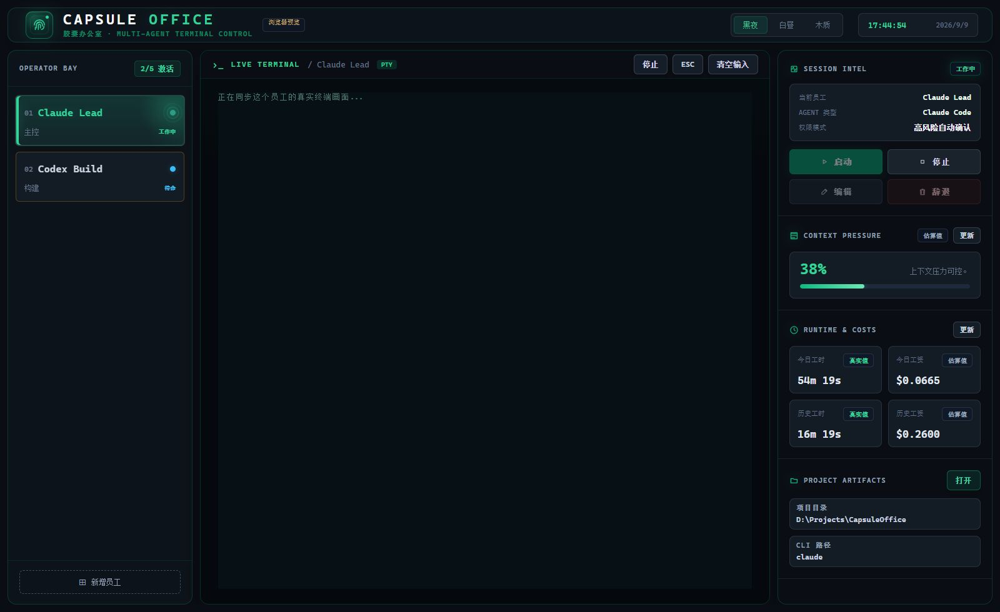

# Capsule Office · 胶囊办公室

给 AI 团队一间办公室。一个面向本地 **Claude Code** 和 **Codex CLI** 的桌面控制室：管理独立 Agent 会话、操作真实终端、查看上下文与用量。

**[项目主页](https://chenzhiyong1994.github.io/capsule-office/)** · **[在线界面演示](https://chenzhiyong1994.github.io/capsule-office/demo/)** · [问题反馈](https://github.com/chenzhiyong1994/capsule-office/issues) · [MIT License](LICENSE)



## 能做什么

- **统一管理**：接入 Claude Code 和 Codex CLI，最多 5 个员工工位，分别关联项目目录、名称和场景标签。
- **真实终端**：Electron + node-pty + xterm.js，支持输入、会话切换、启停和 ESC。
- **状态面板**：展示上下文压力、运行时长和费用估算，区分真实值与估算值；费用根据自定义单价计算，不是服务商账单。
- **三种主题**：黑夜、白昼、木质，主题偏好保存在本机。
- **本地运行**：员工配置与会话状态保存在 Electron 的本地用户数据目录。各 CLI 仍按自己的配置连接服务商。

这是独立会话的管理界面，任务分配与协作由使用者组织。项目目前为 **v0.1.0**，主要面向 Windows，尚未提供打包安装器；macOS / Linux 的真实 CLI 运行流程尚未适配验证。

## 快速开始

准备 Windows 10 / 11、Git、**Node.js 22.12+**，以及已经在终端中安装并登录的 Claude Code 或 Codex CLI。先确认需要使用的 `claude --version` 或 `codex --version` 能在当前 PATH 中运行。

```powershell
git clone https://github.com/chenzhiyong1994/capsule-office.git
cd capsule-office
npm ci
npm run app
```

也可在安装依赖后双击 `Launch-PixelOffice-App.bat`。启动后点击「新增员工」，填写名称、选择 Agent 和项目目录，保存后启动会话。内部包名仍为 `pixel-office`，以保留现有本地数据路径兼容性。

首次运行会下载 Electron 运行时，需要能访问 GitHub Releases。若下载失败，恢复网络后可执行 `node node_modules/electron/install.js` 重试，再运行 `npm run app`。

**权限设置：**当前应用默认选择「高风险自动确认」。它会为 Claude Code 添加 `--dangerously-skip-permissions`，为 Codex CLI 添加 `--dangerously-bypass-approvals-and-sandbox`，并自动回复部分确认提示。首次使用建议在新增员工时改选「标准确认」，以保留 CLI 默认审批流程。修改运行中员工前需先停止会话。

**原生模块：**`node-pty` 是原生依赖。若 `npm ci` 提示 `node-gyp` / C++ 编译错误，需安装 Python 和 Visual Studio Build Tools 的「使用 C++ 的桌面开发」组件后重试；如果原生模块加载失败，应用会回退到普通子进程，PTY 交互能力受限。网页构建只需要前端依赖，不验证桌面原生运行时。

## 在线演示

[项目主页](https://chenzhiyong1994.github.io/capsule-office/#workspace)嵌入真实 React / xterm.js 界面，演示输入任务、读取文件、修改代码、运行测试与返回结果的过程。支持暂停、重播、主题和 Agent 切换；离开可见区域会暂停，系统设置减少动态效果时不会自动播放。

[完整界面演示](https://chenzhiyong1994.github.io/capsule-office/demo/)提供预置的模拟终端记录，点击启动可以回放该 Agent 的操作过程。刷新后模拟会话重置；主题偏好会保留。

所有任务、文件修改、测试通过数与用量均为演示脚本，不是实际执行结果。浏览器演示不会启动真实 Agent，无法访问本地项目目录，终端输入不会执行。真实工作请在本地 Electron 应用中进行。

## 开发与验证

```powershell
npm run dev           # Vite + Electron，开发端口 5173
npm run build         # 构建桌面渲染器到 dist/
npm run start         # 启动已构建的桌面应用
npm run build:site    # 构建项目主页与浏览器演示到 site-dist/
npm run preview:site  # 本地预览 http://127.0.0.1:4174
```

前端构建和 Electron 入口语法检查：

```powershell
npm run build
npm run build:site
node --check electron/main.js
node --check electron/preload.js
node --test tests/preview-playback.test.mjs
npm run check:runtime  # 构建后验证 Electron、原生 PTY、渲染器与 preload IPC
npm audit
git diff --check
```

运行时冒烟检查使用临时用户数据目录和隐藏窗口，只执行 PTY 输出测试，不会启动 AI Agent 或读取已有项目。它覆盖原生模块、页面加载、preload IPC 与上下文隔离，不代替完整端到端测试。涉及会话的改动还需在 Windows 上验证员工创建、CLI 启停、终端输入、会话切换和退出清理。

```text
electron/                Electron 主进程、IPC、CLI 与 PTY 集成
src/                     React 界面与主题样式
site/                    独立项目主页与公开预览截图
scripts/build-site.mjs   将主页与浏览器演示组装为 Pages 站点
.github/workflows/       站点构建、PR 构建检查与 Pages 部署
```

## GitHub Pages

项目主页：**https://chenzhiyong1994.github.io/capsule-office/**

仓库的 Pages 来源使用 **GitHub Actions**。推送 `main` 自动构建并部署主页和 `demo/`；Pull Request 只构建、不部署，也可在 Actions 中手动运行工作流。部署目录只有 `site-dist/`，不会上传桌面运行数据。

主页使用相对资源路径，支持仓库子路径。Fork 后请在 GitHub 设置中开启 Pages 的 GitHub Actions 来源，并更新 README、`package.json`、`site/index.html` 中的仓库和主页链接。

## 本地数据与贡献

员工与会话数据写入 Electron `app.getPath("userData")` 下的 `pixel-office-state.json`。Claude Code 指标集成还可能在所选项目的 `.claude/settings.local.json` 中配置 `statusLine`（保留已有的非本应用 statusLine），并在用户数据目录存储状态快照。提交问题时请删除本地路径、终端内容和账户信息中的私密部分；不要提交状态文件、凭证或 `.env`。

欢迎通过 [Issues](https://github.com/chenzhiyong1994/capsule-office/issues) 描述问题和建议，或提交聚焦的 Pull Request。界面改动请附截图；会话改动请说明 Windows、Node.js、CLI 版本和复现步骤。

源码与本项目自有素材采用 [MIT License](LICENSE)。依赖保留各自许可证。Claude Code、Codex 及相关名称属于各自权利人，本项目为独立社区项目。
